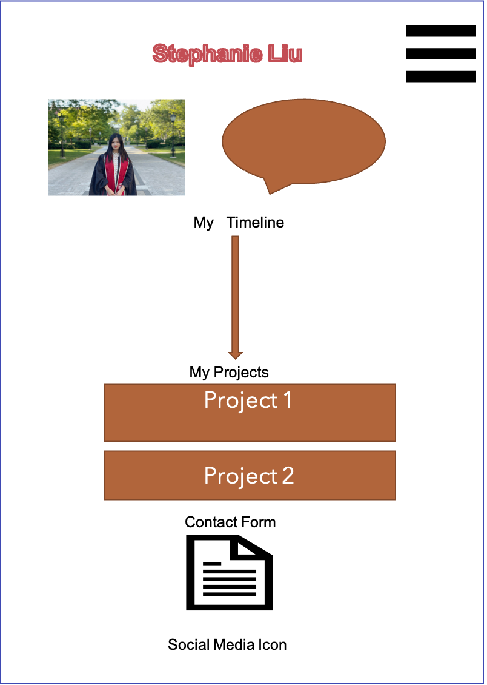

# Project Overview
## Project Schedule
This schedule will be used to keep track of your progress throughout the week and align with our expectations.  
You are **responsible** for scheduling time with your squad to seek approval for each deliverable by the end of the corresponding day, excluding `Saturday` and `Sunday`.
|  Day | Deliverable | Status
|---|---| ---|
|Day 1| Project Description | complete
|Day 1| Wireframes / Priority Matrix / Timeline | complete
|Day 3 /Sunday| Core Application Structure (HTML, CSS, etc.) | complete
|Day 4/ Monday| Project Preview &Nav &Flex | complete
|Day 5/ Tuesday| Responsive & Interactive Icon| complete
|Day 6/ Wednesday| API& Final Touches | complete
|Day 7/ Thursday| Present | complete
## Project Description
A personal portfolio that includes an about section, my projects and the social media contact. 
## Portfolio I want to Emulate
Search and compare at least 3 profile web sites.  Record your findings in the table below and include some aspect of the site that you would like to incorporate into your own site.
Link To Site  | One Thing I'd Like To Incorporate | 
| ------------- | ------------- |
| [https://www.simplytabitha.com/] | landing page animation| 
|[http://www.rleonardi.com/interactive-resume/]| animation/games|
| [https://www.lianapenn.com/]|  Project display| 


## Wireframes
Upload images of wireframe to cloudinary and add the link here with a description of the specific wireframe. Do not include the actual image and have it render on the page.  



- [Mobile](https://i.imgur.com/P3iBEZf.jpg)
- [Desktop](https://i.imgur.com/xpOWo0E.jpg)
Wireframing Resources:
- [Mockflow](https://mockflow.com/app/#Wireframe)
- [Figma](https://www.figma.com/)
## Time/Priority Matrix 

---
Include a full list of features that have been prioritized based on the `Time and Priority` Matix.  This involves drawing a a square.  In the middle of the square, on the x axis draw a line.  The most left part of the line should start with 0hrs and the end of the line should include 2hrs.  This line will be used to estimate how much time any one feature will take to complete. 
Now draw a vertical line on the y axis.  The top of this line should have `High` and the bottom `Low`.  This line will be used to assign a priority to to each feature you wish to include in the project.  
Now create a separate list starting with A and assign it one of the features.  Continue to assign each feature a letter.  Once complete add each letter to the matrix assigning based on what your feel it's prioirty is an how long it will take to implement. If any one feature takes longer than 2hrs to complete than break it down into smaller tasks and reassign them a new letter. 
Once complete tally up the time and determine how long the project will take to complete. Now break those features into MVP and PostMVP so you can guarantee you will have a fully functioning project to demo. 
### MVP/PostMVP - 5min
The functionality will then be divided into two separate lists: MPV and PostMVP.  Carefully decided what is placed into your MVP as the client will expect this functionality to be implemented upon project completion.  
#### MVP (examples)
- Pull data using google json api
- Render data on page 
- Allow user to choose favorites 
- Save their choices in firebase
#### PostMVP 
- Anything else that is not MVP
## Functional Components
Based on the initial logic defined in the previous sections try and breakdown the logic further into functional components, and by that we mean functions.  Try and capture what logic would need to be defined if the game was broken down into the following categories.
Time frames are also key in the development cycle.  You have limited time to code all phases of the game.  Your estimates can then be used to evalute game possibilities based on time needed and the actual time you have before game must be submitted. It's always best to pad the time by a few hours so that you account for the unknown so add and additional hour or two to each component to play it safe.
#### MVP
| Component | Priority | Estimated Time | Actual Time |
| --- | :---: |  :---: | :---: | 
| HTML and CSS setup | H |  5hr | 8hr| 
| Hamburger | H | 1hr | 1hr |
| Project Previews | H | 3hr | 3hr |
| Navbar | H | 2hr | 1hr |  
| Adding Form | L | 2hr|  3hr | 
| Buttons/Interactive Icons| M | 3hr | 1hr|
| Working with API | H | 6hrs|  2hr | 
| Responsive | H | 5hr | 5hr |
| Social Media Icons | L | 1hr |  1hr |
| Total | H | 28hrs| 25hrs |
#### PostMVP
| Component | Priority | Estimated Time | Actual Time |
| --- | :---: |  :---: | :---: | 
| Interactive Banner | M | 4hr | hr |
| Bootstrap | H | 2hr | 2hr |
| Animation | H | 4hr | hr |
| Total | H | 10hrs| 2hrs |
## Additional Libraries
 Use this section to list all supporting libraries and thier role in the project. 
 bootstrap: for nav bar 
 fontawesome: for icons 
## Code Snippet
Use this section to include a brief code snippet of functionality that you are proud of an a brief description  
```
//p.speech{
    position: relative;
    background: #6594bf; opacity: 0.8;
    margin-left: 20px; 
    margin-right: 5px;
    margin-top:-10px; 
    color:white; 
    font-family: Georgia, 'Times New Roman', Times, serif;
    font-size: 20px;
    box-shadow: 2px 2px 2px 0px #A3A3A3 ;
    text-align: center;
    border-radius: 22px;
    padding: 10px;
}
p.speech:after {
    content: '';
    position: absolute;
    display: block;
    width: 0;
    z-index: 1;
    border-style: solid;
    border-color: #6594bf transparent;
    border-width: 10px 11px 0;
    bottom: -10px;
    left: 30%;
    margin-left: -11px;
} // here is the code for speech bubble layout 

//<div class="card" style="width: 18rem;">
          
            <div class="card-body">
             <h5 class="card-title">${project.title}</h5>
              <p class="card-description">${project.description}</p>
              <a class="link" href="${project.link}">Click for details</a>
            </div>// code for project card 

## Issues and Resolutions
 Use this section to list of all major issues encountered and their resolution.
#### SAMPLE.....
**ERROR**: app.js:34 Uncaught SyntaxError: Unexpected identifier                                
**RESOLUTION**: Missing comma after first object in sources {} object

**ERROR**: background image not displayed properly 
**RESOLUTION**: deleting the extra span tag 

**ERROR**: projects card not linked to bootstrap 
**RESOLUTION**: including a bootstrap sample in 
